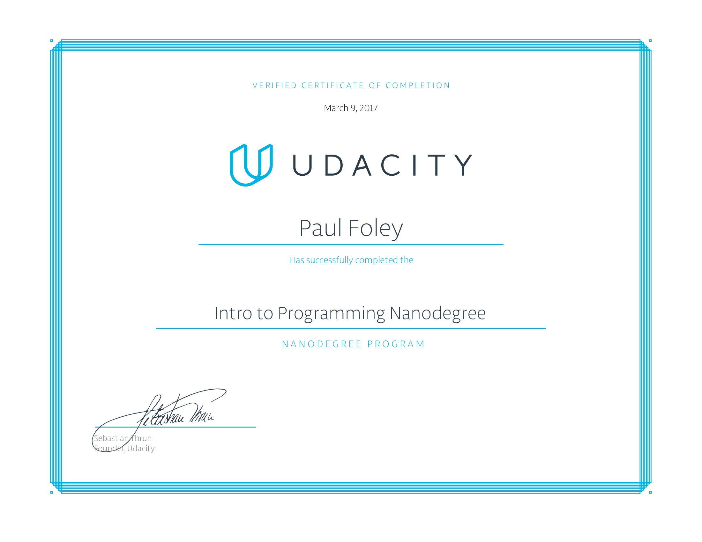

# Udacity Nanodegree - Full Stack

The [Udacity Full Stack Nanodegree](https://www.udacity.com/course/full-stack-web-developer-nanodegree--nd004) is built with leading technology companies, such as [Amazon](https://aws.amazon.com/), [GitHub](https://github.com/), [AT&T](https://www.att.com/), and [Google](https://www.google.com/) to ensure mastery of the exact skills necessary to build a career in web development.

## Nanodegree Overview

Full stack web developers are the go-to experts that companies rely on to build, support, and maintain their web applications. They're responsible for the following:

* Understanding how the web works.
* Developing complex relational databases to persistently store an applications data.
* Building complete web applications using [Python](https://www.python.org/), [HTML5](https://www.w3schools.com/html/default.asp), [CSS](https://www.w3schools.com/html/html_css.asp), [JavaScript](https://www.w3schools.com/js/default.asp), and [SQL](https://www.w3schools.com/sql/default.asp).
* Securing and configuring [Linux](https://www.linux.org/)-based servers.
* Scaling web applications to support hundreds of thousands of users.

The projects found in this [GitHub Repository](https://github.com/paulfoley/Udacity_Nanodegree-Full_Stack) will clearly demonstrate mastery of key skills in full stack web development.

### Curriculum

The following topics are covered in order:

1. Programming Fundamentals
2. Developers' Tools
3. Backend: Databases & Applications
4. Fontend: [JavaScript](https://www.w3schools.com/js/default.asp) & [AJAX](https://www.w3schools.com/xml/ajax_intro.asp)
5. Deployment: [Linux](https://www.linux.org/) Servers

### Certificate of Completion

#### Full Stack

`TBC`

#### Programming

## Projects

Complex server-side web applications that use powerful relational databases to persistently store data, can support any front-end, and scale to support hundreds of thousands of users.

### Table of Contents

`TBC`

### Environment

`TBC`

### Useful Third-Party Packages

To be an effective programmer you need to know what libraries are available for you to use. People typically learn about useful new libraries by word of mouth; from an online recommendation or from a colleague. 

Here's a list of python packages that are popular:

- IPython - A better interactive Python interpreter
- requests - Provides easy to use methods to make web requests. Useful for accessing web APIs.
- Flask - a lightweight framework for making web applications and APIs.
- Django - A more featureful framework for making web applications. Django is particularly good for designing complex, content heavy, web applications.
- Beautiful Soup - Used to parse HTML and extract information from it. Great for web scraping.
- pytest - extends Python's builtin assertions and unittest module.
- PyYAML - For reading and writing YAML files.
- NumPy - The fundamental package for scientific computing with Python. It contains among other things a powerful N-dimensional array object and useful linear algebra capabilities.
- pandas - A library containing high-performance, data structures and data analysis tools. In particular, pandas provides dataframes!
- matplotlib - a 2D plotting library which produces publication quality figures in a variety of hardcopy formats and interactive environments.
- ggplot - Another 2D plotting library, based on R's ggplot2 library.
- Pillow - The Python Imaging Library adds image processing capabilities to your Python interpreter.
- pyglet - A cross-platform application framework intended for game development.
- Pygame - A set of Python modules designed for writing games.
- pytz - World Timezone Definitions for Python

### Hierarchy of Online Resources
W
hile there are many online resources about programming, not all of the them are created equal. This list of resources is in approximate order of reliability:

1. The Python Tutorial - This section of the official documentation surveys Python's syntax and standard library. It uses examples, and is written using less technical language than the main documentation. Make sure you're reading the Python3 version of the docs!

2. The Python Language and Library References - The Language Reference and Library Reference are more technical than the tutorial, but hey are the definitive source of truth. As you become more acquainted with Python you should get begin to use these resources more and more.

3. Third-Party Library Documentation - Third-party libraries publish their documentation on their own websites, and often times at https://readthedocs.org/. You can judge the quality of a third-party library by the quality of its documentation. If the developers haven't found time to write good docs, they probably haven't found the time to polish their library either.

4. The websites and blogs of prominent experts - The previous resources are primary sources, meaning that they are documentation from the same people who wrote the code being documented. Primary sources are the most reliable. Secondary sources are also extremely valuable. The difficulty with secondary sources is determining the credibility of the source. The websites of authors like Doug Hellmann and developers like Eli Bendersky are excellent. The blog of an unknown author might be excellent, or it might be rubbish.

5. Stackoverflow - This question and answer site has a good amount of traffic, so it's likely that someone has asked (and someone has answered) a related question before! However, answers are provided by volunteers and vary in quality. Always understand solutions before putting them into your program. One line answers without any explanation are dubious. This is a good place to find out more about your question or discover alternative search terms.

6. Bug Trackers - Sometimes you'll encounter a problem so rare, or so new, that no one has addressed it on Stackoverflow. You might might a reference to your error in a bug report on GitHub for instance. These bug reports can be helpful, but you'll probably have to do some original engineering work to solve the problem.

7. Random Web Forums - Sometimes your search yields references to forums that haven't been active since 2004, or some similarly ancient time. If these are the only resources that address your problem, you should rethink how you're approaching your solution.

### Authors

* **[Paul Foley](https://github.com/paulfoley)**
* [Udacity](https://www.udacity.com/)

### License

* <a rel="license" href="https://creativecommons.org/licenses/by-nc-nd/4.0/"> Creative Commons Attribution-NonCommercial-NoDerivatives 4.0 International License</a>

